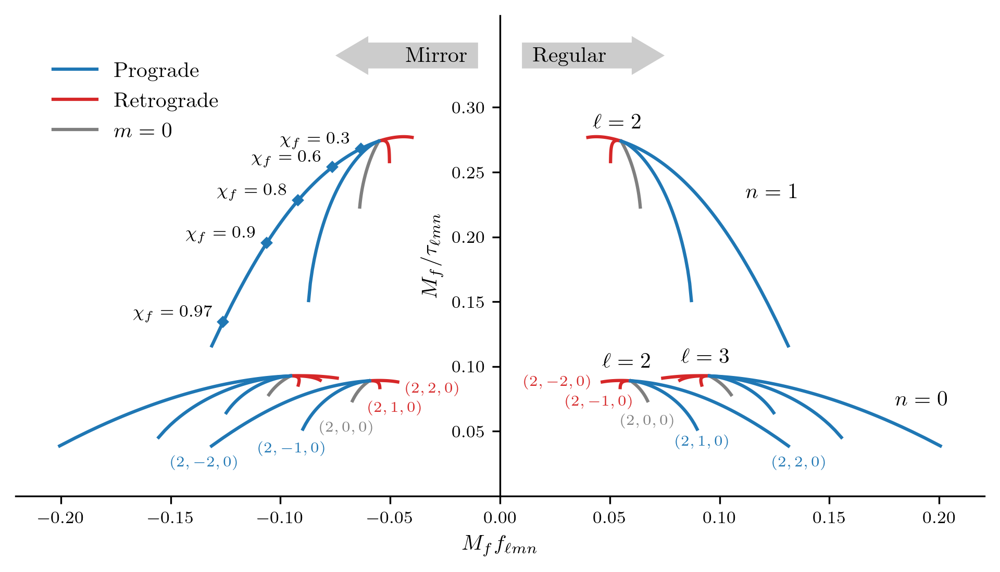
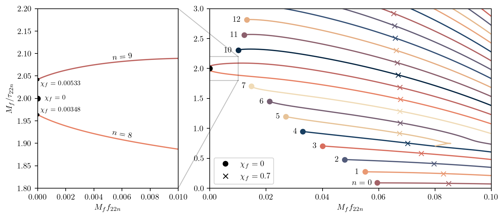

# qnmfits
Least-squares fitting of quasinormal modes to ringdown waveforms.

## Installation

The package can be installed with `pip install .` - this assumes you are in the same directory as the `pyproject.toml` file. All dependencies for SXS waveform analysis should be installed automatically. Currently, the [`gwsurrogate`](https://pypi.org/project/gwsurrogate/) and [`surfinBH`](https://pypi.org/project/surfinBH/) packages (needed for the analysis of surrogate models) are not automatically installed.

Note that when first importing the package, there may be a short delay.

You may prefer to install the dependencies via `conda` - please see the dependencies in the `pyproject.toml` file. All packages are available on `conda` or `conda-forge`. You may additionally need to install `spinsfast` via

```bash
conda install --channel conda-forge spinsfast
```

If using `conda`, I recommend installing all dependencies via `conda` first, and then running `pip install .` in the cloned `qnmfits` directory.

## Usage

The core of the package is the [`qnmfits.py`](qnmfits/qnmfits.py) file; this contains a collection of functions for performing ringdown analyses on any supplied waveform. For an overview of the available functions, see the [package tutorial notebook](examples/package_tutorial.ipynb).

Often you will want to work with SXS waveforms. For this we provide a [`SXS` helper class](qnmfits/Waveforms/Simulation.py#L12) (also demonstrated in the package tutorial) to load and manipulate waveforms (see the functions in [`Base.py`](qnmfits/Waveforms/Base.py) to see what manipulations are available). You can, of course, load the SXS waveform data by other means and then pass it to the functions in `qnmfits.py`. Similar to the `SXS` class, there are classes for loading [NRSur7dq4](qnmfits/Waveforms/Surrogate.py#L7) and [NRHybSur3dq8](qnmfits/Waveforms/Surrogate.py#L201) surrogate waveforms (note that these are less well-tested).

## A note on QNM labelling

In this package QNMs are specified with four numbers: `(ell, m, n, sign)`. The first three numbers refer to the usual angular (`ell`), azimuthal (`m`), and overtone (`n`) indices. The fourth number is either `+1` or `-1`, and refers to the sign of the real part of the QNM frequency. In other words, `sign=1` refers to the "regular" QNMs to the right of the imaginary axis, and `sign=-1` refers to "mirror" QNMs to the left of the imaginary axis. Note that this is different to the prograde (co-rotating) and retrograde (counter-rotating) classification you sometimes see. See the figure below ([source code here](examples/qnm_taxonomy.ipynb)) for a visualisation of the different QNM labelling conventions:



If you want use QNMs with an overtone index `n>7`, then you will encounter QNM "multiplets" for which there are different labelling conventions. For example, the Schwarzschild (2,2,8) QNM has the behaviour of "splitting" into two branches when the spin is increased:



This has led to these two branches being labelled as (2,2,8<sub>0</sub>) and (2,2,8<sub>1</sub>) by Cook & Zalutskiy ([arxiv:1607.07406](http://arxiv.org/abs/1607.07406)). However, from a practical perspective we will be mostly working with Kerr black holes, and these two branches behave as a `n=8` and `n=9` overtone. So, as indicated by the figure above, we label them as such (this follows the convention of 
